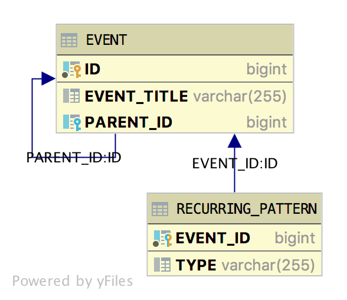

Spring Data JPA app that tries out a pair of entities, `Event` and `RecurringPattern`, such that
the `RecurringPattern` has both a `@OneToOne` relationship to `Event` but also uses the `Event` as
the primary key.

Here is a schema diagram of the SQL relationship:



## Running

The application includes its own H2 library, so it can be started up and used with:

```
./mvnw spring-boot:run
```